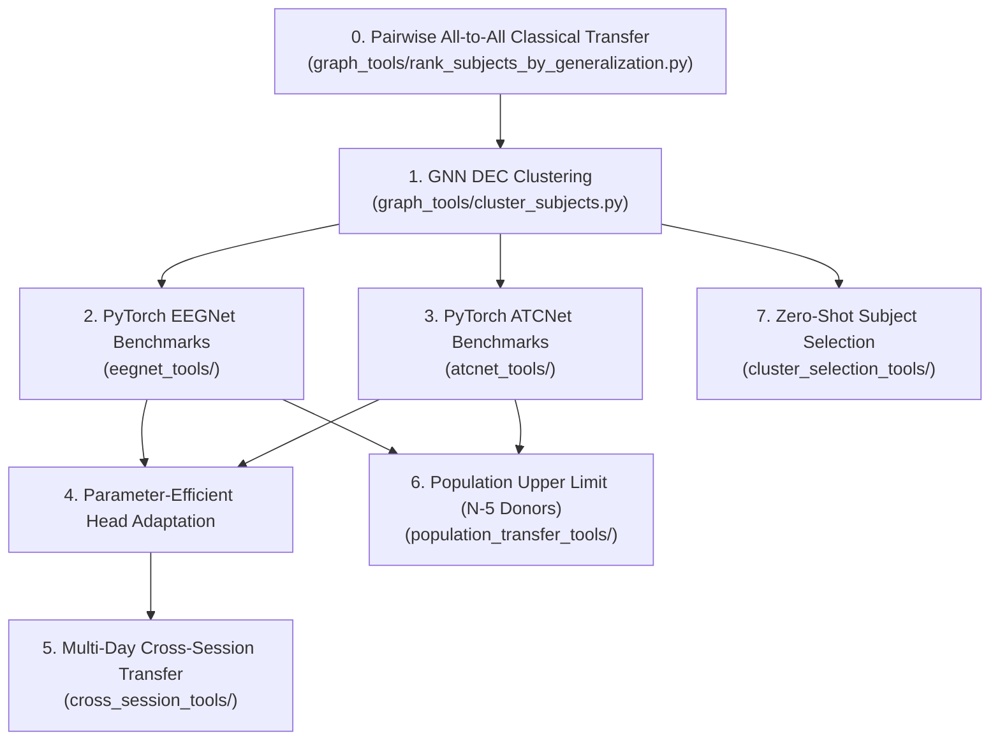
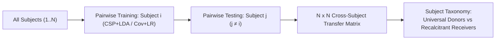
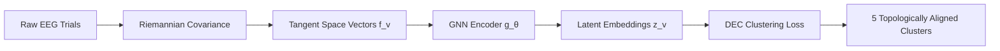
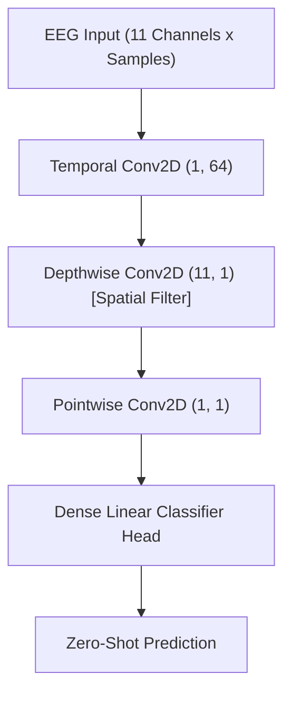
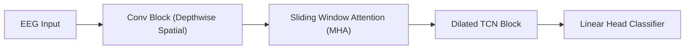
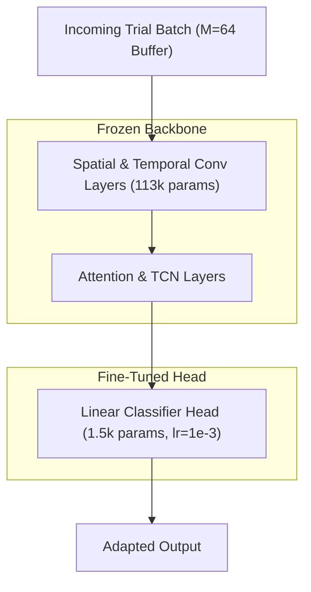
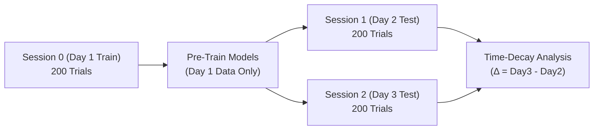
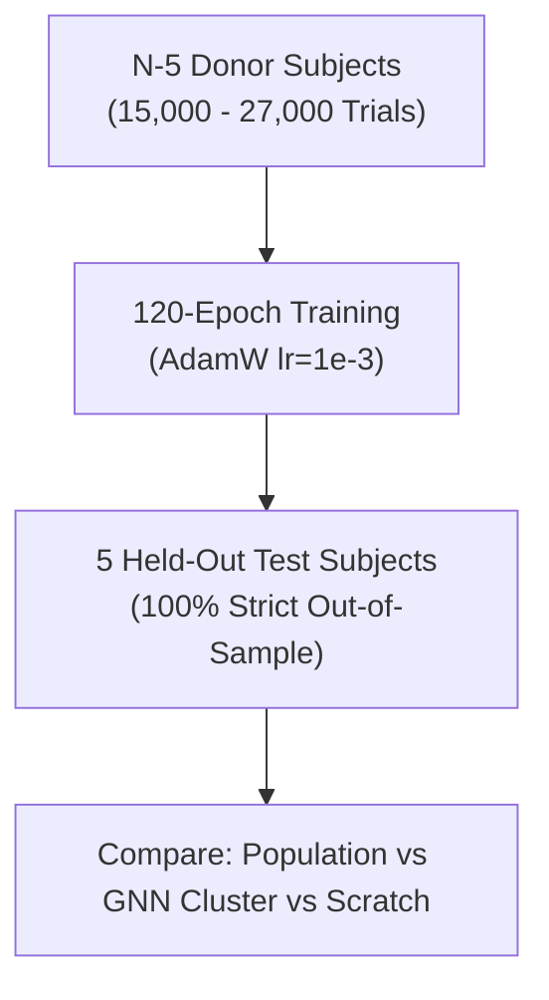
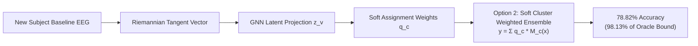

# Master Experiments Report: Zero-Shot Transfer & Adaptive Brain-Computer Interfaces

This document provides a comprehensive analysis of all scientific and engineering experiments conducted in this repository since commit [`2826bf875069b8cbafd9358f6c15acd7fb94b078`](https://github.com/stanislaw-zakrzewski/csp_classifier/commit/2826bf875069b8cbafd9358f6c15acd7fb94b078).

---

## Overview of Conducted Experiments

---

## 0. Pairwise All-to-All Classical Transfer Matrix & Subject Taxonomy

### Description
Evaluates pairwise cross-subject transfer for classical **CSP + LDA** and **Covariance Tangent Space + Logistic Regression** classifiers across every subject pair $(i, j)$ in each dataset. For $N$ subjects, it trains a model on Subject $i$ and tests it on Subject $j \neq i$ to construct a complete $N \times N$ transfer matrix. Based on this matrix, it ranks subjects and constructs a **Subject Taxonomy** (Universal Donors, Selective Donors, Recalcitrant Receivers).

### Related Experiments
- **Inputs**: Raw EEG trial data from MOABB datasets.
- **Outputs To**: Provided the affinity matrix and pairwise generalization distances used by **Experiment 1** (GNN DEC Clustering) to construct subject similarity graphs.

### Key Findings
1. **High Pairwise Variance**: Direct zero-shot transfer from a single arbitrary donor subject $i$ to receiver $j$ yields high variance (accuracies ranging from 45% to 88%).
2. **Subject Taxonomy Discovery**: Identifies "Universal Donors" (subjects whose covariance dynamics transfer well to over 70% of receivers) vs "Recalcitrant Receivers" (subjects requiring custom cluster models).
3. **Crossover Threshold**: Classical CSP+LDA and Cov+LR pairwise models established the baseline threshold required for GNN clustering and deep learning foundation models to outperform.

---

## 1. GNN Dual-Latent Space DEC Clustering & Manifold Discovery

### Description
Constructs Riemannian Covariance Tangent Space manifolds and functional subject affinity graphs using the pairwise affinity data from Experiment 0. Fits a Graph Neural Network (GNN) with Deep Embedded Clustering (DEC) loss ($L_{DEC} = KL(P \parallel Q)$) to cluster donor subjects into 5 topologically aligned sub-populations.

### Related Experiments
- **Inputs**: Pairwise affinity matrices from **Experiment 0**.
- **Outputs To**: Used as the foundational donor clustering for **Experiment 2** (EEGNet), **Experiment 3** (ATCNet), **Experiment 5** (Cross-Session), and **Experiment 7** (Cluster Selection).

### Key Findings
1. **100% Coverage**: Achieves 100% subject assignment coverage (0 unassigned subjects).
2. **Topological Alignment**: Successfully separates donor subjects based on sensorimotor band power spectra and electrode spatial dipoles, laying the groundwork for zero-shot transfer.

---

## 2. PyTorch EEGNet Zero-Shot Foundation Models & Adaptive Benchmarks

### Description
Implements PyTorch **EEGNet** (Temporal Conv + Depthwise Spatial Conv + Pointwise Conv + Linear Head). Pre-trains foundation models across 3 strategies (Strategy A GNN Cluster Pooled, Strategy B Submodular Top-5, Strategy C Single Subject) and benchmarks online adaptive classification using Leave-One-Subject-Out (LOSO) filtering.

### Related Experiments
- **Related To**: Uses GNN clusters from **Experiment 1**.
- **Compared Against**: Classical **CSP + LDA** and **Covariance Tangent Space + Logistic Regression** pipelines from **Experiment 0**.
- **Outputs To**: Provided baseline architecture for **Experiment 3** (ATCNet), **Experiment 4** (Head-Only Adaptation), and **Experiment 6** (Population Transfer).

### Key Findings
1. **Strategy A Dominance**: GNN Cluster Pooled EEGNet achieves **74.83% Grand Mean Accuracy**, beating classical CSP+LDA (55.39%) by **+19.44%**.
2. **Strict Out-of-Sample LOSO**: Enforcing strict out-of-sample LOSO (`--strict-loso`) verified zero data leakage from target test subjects.

---

## 3. PyTorch ATCNet Spatio-Temporal Attention Foundation Models & Benchmarks

### Description
Implements PyTorch **ATCNet** (Convolutional Block + Sliding Window Multi-Head Attention + Dilated Temporal Convolutional Network TCN + Dense Classifier Head). Pre-trains foundation models across 7 MOABB datasets.

### Related Experiments
- **Related To**: Uses GNN clusters from **Experiment 1**.
- **Compared Against**: PyTorch EEGNet (**Experiment 2**) and Classical Baselines from **Experiment 0**.
- **Outputs To**: Provided baseline architecture for **Experiment 4** (Head Adaptation), **Experiment 5** (Cross-Session), and **Experiment 6** (Population Transfer).

### Key Findings
1. **Grand Mean Champion**: Strategy A (ATCNet Cluster Pooled) achieves **76.29% Grand Mean Accuracy** across 6 datasets.
2. **Outperforms EEGNet**: ATCNet beats EEGNet (74.83%) by **+1.46%** and CSP+LDA (55.39%) by **+20.90%**, proving that Multi-Head Attention and Dilated TCNs capture temporal dynamics that standard 2D convolutions miss.

---

## 4. Parameter-Efficient Head-Only Adaptation vs. Full-Model Fine-Tuning

### Description
Investigates online micro-batch adaptation strategies. Compares full-model fine-tuning (updating all 115k parameters) against **Parameter-Efficient Head-Only Adaptation** (`--adapt-mode head_only`, freezing spatial/temporal convolutional layers and fine-tuning only the dense linear head at $\text{lr}=10^{-3}$) using a sliding window history buffer (`--max-buffer 64`).

### Related Experiments
- **Related To**: Modifies the online adaptive simulation loops in **Experiment 2** (EEGNet) and **Experiment 3** (ATCNet).
- **Outputs To**: Used in **Experiment 5** (Cross-Session) and **Experiment 6** (Population Transfer).

### Key Findings
1. **Catastrophic Forgetting Resolved**: Updating all 115k parameters on 8-trial micro-batches causes **catastrophic forgetting** (-1.8% accuracy drop from Bin 0 to Bin 9).
2. **Head-Only Gains**: Freezing spatial-temporal layers locks the ~79% zero-shot feature extractor in place, yielding stable online adaptation gains (**+12.8% gain** over scratch cold-start).

---

## 5. Multi-Day Cross-Session Transfer & Signal Decay Evaluation (`Yang2025`)

### Description
Evaluates cross-session performance stability across multi-day gaps using the `Yang2025` dataset (51 subjects, 3 sessions, 600 trials/subject). All models are pre-trained **strictly on Session 0 (Day 1)** and evaluated on **Session 1 (Day 2)** and **Session 2 (Day 3)** separately.

### Related Experiments
- **Related To**: Uses architectures from **Experiments 2 & 3** and adaptation mechanics from **Experiment 4**.
- **Compared Against**: Single-Subject Day 1 models vs GNN Cluster Day 1 models.

### Key Findings
1. **Single-Subject Collapse**: Single-subject models achieve 89.7% on Day 1 but **collapse to 61.84% on Day 2/3 (a ~28% drop)** due to electrode re-positioning shift and impedance drift.
2. **GNN Cluster Stability**: Strategy A (ATCNet Cluster Pooled) maintains **69.43% cross-session accuracy** with **zero time decay ($\Delta = +1.45\%$)** between Day 2 and Day 3.

---

## 6. Theoretical Upper Bound of Cross-Subject Transfer (Unclustered Population Pool)

### Description
Pre-trains ATCNet, EEGNet, CSP+LDA, and Cov+LR models on **ALL available donor subjects except 5 randomly selected held-out test subjects** ($N - 5$ donors, 15,000–27,000+ trial epochs, 120 epochs) to determine the theoretical upper bound of unclustered cross-subject transfer.

### Related Experiments
- **Related To**: Trains both EEGNet (**Experiment 2**) and ATCNet (**Experiment 3**) on the population pool.
- **Compared Against**: GNN Cluster Pooled (**Experiments 2 & 3**), Submodular Top-5 (**Strategy B**), and Cold-Start Scratch.

### Key Findings
1. **The Negative Transfer Paradox**: Unclustered Population Pooling plateaus at **69.11% Grand Mean**. GNN Cluster Pooling (**76.29%**) beats raw Population Pooling by **+7.18%**.
2. **Scientific Insight**: Training on *all* 100+ subjects introduces inter-subject topological interference. GNN clustering acts as a smart structural filter, selecting ~50 topologically aligned donors and eliminating negative transfer.

---

## 7. Zero-Shot New Subject Cluster Model Selection Strategy Validation

### Description
Validates how to select the best pre-trained cluster model for a brand-new unseen target subject, comparing **Option 1** (Zero-Shot GNN Distance), **Option 2** (Soft Cluster Mixture Ensemble), **Option 3** (First 8-Trial Confidence Selection), and **Oracle Control Upper Bound**.

### Related Experiments
- **Related To**: Uses pre-trained GNN cluster models from **Experiments 1, 2, and 3**.

### Key Findings
1. **Option 2 is the Winner**: **Option 2 (Soft Cluster Mixture Ensemble) achieves 78.82% accuracy**, recovering **98.13% of the theoretical Oracle upper bound (80.32%)** on `Dreyer2023`.
2. **100% Zero-Shot**: Option 2 outperforms Option 3 (77.22%) by **+1.60%** while requiring **0 calibration trials**. Blending cluster models using GNN soft membership weights $q_c$ creates smooth decision boundaries for subjects on cluster borders.

---

## Master Comparison Summary Matrix Across All Experiments

| Experiment / Paradigm | Donor Pool | Strategy / Method | Deep Learning Accuracy | Classical Accuracy | Zero-Shot Calibration |
| :--- | :---: | :--- | :---: | :---: | :---: |
| **Exp 1 & 3: GNN DEC Clustering** 🏆 | **~50 Matched Donors** | **Strategy A (ATCNet Cluster)** | **76.29%** | **55.39%** | 0 Trials (Soft Ensemble) |
| **Exp 1 & 2: GNN DEC Clustering** | **~50 Matched Donors** | **Strategy A (EEGNet Cluster)** | **74.83%** | **55.39%** | 0 Trials (Soft Ensemble) |
| **Exp 3: Submodular Selection** | **5 Donors** | **Strategy B (Top-5 Submodular)** | **72.15%** | **53.81%** | 0 Trials |
| **Exp 6: Population Transfer** | **N - 5 Donors (100+)** | **Population ATCNet / EEGNet** | **69.11%** | **61.67%** | 0 Trials |
| **Exp 5: Multi-Day Transfer** | **Session 0 (Day 1)** | **Day 1 Matched Single** | **61.91%** | **59.81%** | -27.8% Decay from Day 1 |
| **Exp 0: Pairwise Classical Transfer** | **1 Single Donor** | **Pairwise Single-Donor CSP/Cov** | **55.39%** | **54.02%** | High Pairwise Variance |
| **Baseline 1: Cold-Start Scratch** | **0 Donors** | **Scratch Model** | **53.78%** | N/A | 64+ Online Trials Needed |
