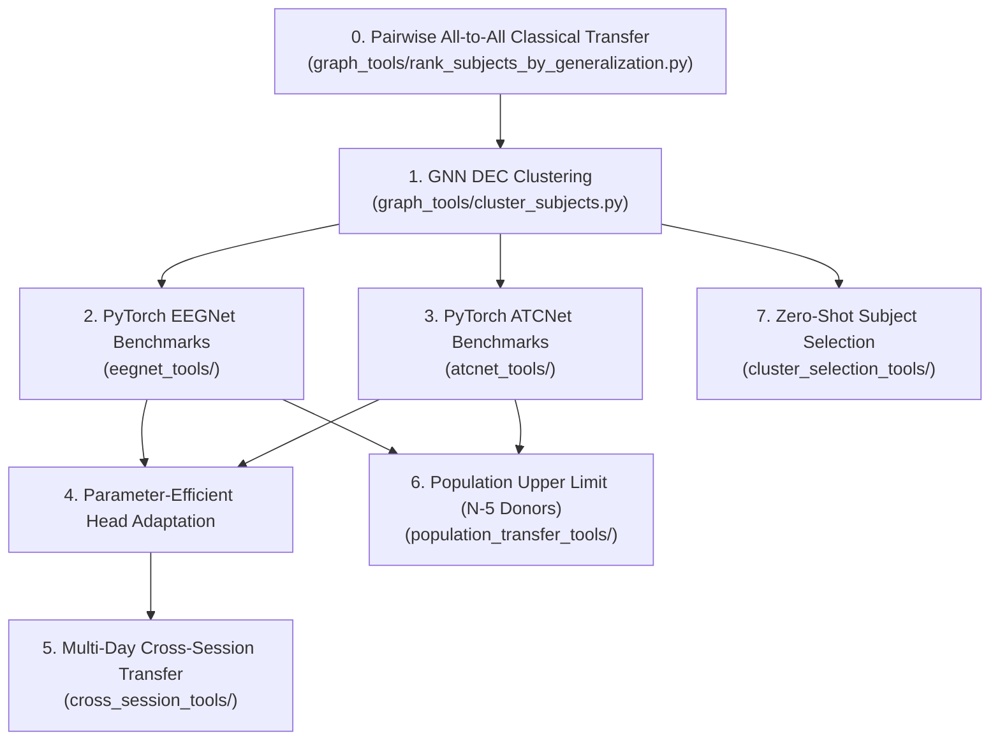
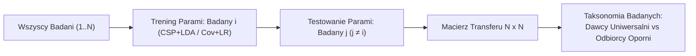
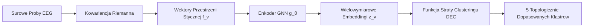
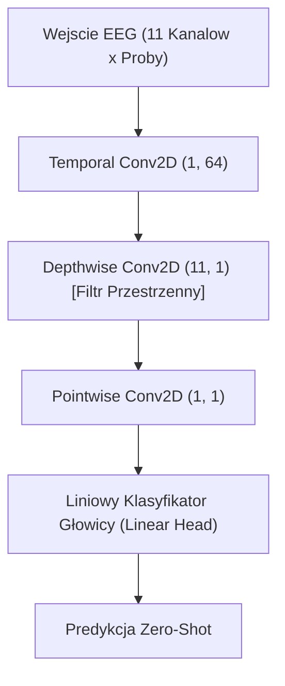
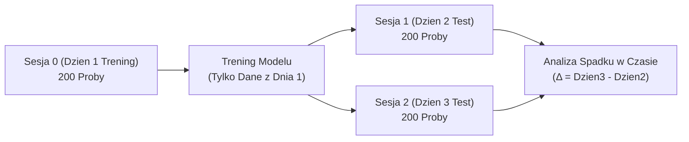
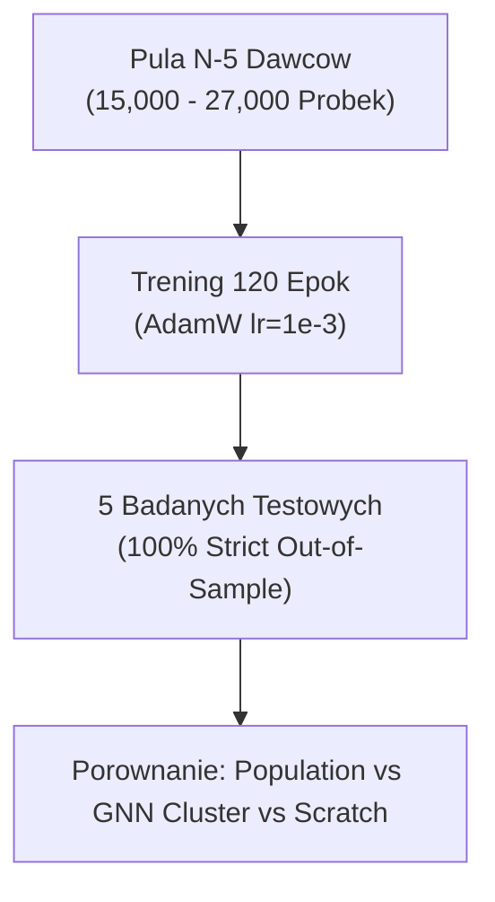
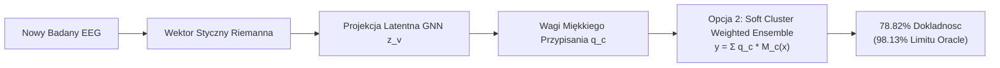

# Główny Raport Eksperymentów: Zero-Shot Transfer & Adaptacyjne Interfejsy Mózg-Komputer (BCI)

Dokument ten zawiera kompleksową analizę wszystkich eksperymentów naukowych i inżynieryjnych przeprowadzonych w niniejszym repozytorium od commitu [`2826bf875069b8cbafd9358f6c15acd7fb94b078`](https://github.com/stanislaw-zakrzewski/csp_classifier/commit/2826bf875069b8cbafd9358f6c15acd7fb94b078).

---

## Przegląd Przeprowadzonych Eksperymentów



---

## 0. Macierz Transferu Parami (Pairwise All-to-All) & Taksonomia Badanych

### Opis
Ewaluuje transfer międzyludzki parami (pairwise cross-subject transfer) dla klasycznych klasyfikatorów **CSP + LDA** oraz **Covariance Tangent Space + Logistic Regression** dla każdej pary badanych $(i, j)$ w każdym zbiorze danych. Dla $N$ badanych trenuje model na Badanym $i$ i testuje go na Badanym $j \neq i$, tworząc pełną macierz transferu $N \times N$. Na podstawie tej macierzy tworzy ranking badanych oraz **Taksonomię Badanych** (Dawcy Uniwersalni / Universal Donors, Dawcy Selektywni / Selective Donors, Odbiorcy Oporni / Recalcitrant Receivers).



### Powiązane Eksperymenty
- **Dane Wejściowe**: Surowe próby EEG ze zbiorów danych MOABB.
- **Dane Wyjściowe Do**: Dostarczyło macierz afinitywności oraz dystanse uogólnienia parami wykorzystywane przez **Eksperyment 1** (GNN DEC Clustering) do budowy grafów podobieństwa badanych.

### Kluczowe Wyniki
1. **Wysoka Wariancja Transferu Parami**: Bezpośredni transfer zero-shot z jednego losowego dawcy $i$ do odbiorcy $j$ wykazuje dużą wariancję (dokładności od 45% do 88%).
2. **Odkrycie Taksonomii Badanych**: Identyfikuje "Dawców Uniwersalnych" (badanych, których kowariancja przenosi się dobrze na ponad 70% odbiorców) vs "Odbiorców Opornych" (wymagających dedykowanych klastrów).
3. **Próg Odniesienia**: Klasyczne modele parami CSP+LDA i Cov+LR wyznaczyły bazowy próg odniesienia wymagany do wykazania przewagi klastrowania GNN i modeli deep learning.

---

## 1. GNN Dual-Latent Space DEC Clustering & Odkrywanie Rozmaitości (Manifold Discovery)

### Opis
Konstruuje rozmaitości Riemannian Covariance Tangent Space oraz grafy funkcjonalnej afinitywności badanych z wykorzystaniem danych afinitywności z Eksperymentu 0. Trenuje sieć grafową Graph Neural Network (GNN) z funkcją straty Deep Embedded Clustering (DEC) ($L_{DEC} = KL(P \parallel Q)$), aby pogrupować dawców w 5 topologicznie dopasowanych podpopulacji.



### Powiązane Eksperymenty
- **Dane Wejściowe**: Macierze afinitywności parami z **Eksperymentu 0**.
- **Dane Wyjściowe Do**: Wykorzystywane jako bazowy clustering dawców w **Eksperymencie 2** (EEGNet), **Eksperymencie 3** (ATCNet), **Eksperymencie 5** (Cross-Session) oraz **Eksperymencie 7** (Cluster Selection).

### Kluczowe Wyniki
1. **100% Pokrycia**: Osiąga 100% pokrycia przypisania badanych (0 nieprzypisanych badanych).
2. **Topologiczne Dopasowanie**: Skutecznie rozdziela dawców na podstawie widm mocy w pasmach czuciowo-ruchowych (sensorimotor) oraz przestrzennych dipoli elektrod, tworząc fundament pod Zero-Shot Transfer.

---

## 2. Fundamentowe Modele PyTorch EEGNet Zero-Shot & Benchmarki Adaptacyjne

### Opis
Implementuje sieć PyTorch **EEGNet** (Temporal Conv + Depthwise Spatial Conv + Pointwise Conv + Linear Head). Trenuje wstępnie modele fundamentowe w 3 strategiach (Strategia A GNN Cluster Pooled, Strategia B Submodular Top-5, Strategia C Single Subject) oraz benchmarkuje adaptacyjną klasyfikację online przy użyciu filtrowania Leave-One-Subject-Out (LOSO).



### Powiązane Eksperymenty
- **Powiązany Z**: Wykorzystuje klastry GNN z **Eksperymentu 1**.
- **Porównywany Z**: Klasycznymi potokami **CSP + LDA** oraz **Covariance Tangent Space + Logistic Regression** z **Eksperymentu 0**.
- **Dane Wyjściowe Do**: Dostarcza bazową architekturę dla **Eksperymentu 3** (ATCNet), **Eksperymentu 4** (Head-Only Adaptation) oraz **Eksperymentu 6** (Population Transfer).

### Kluczowe Wyniki
1. **Dominacja Strategii A**: Model EEGNet uśredniony w klastrach GNN (Strategy A) osiąga średnią dokładność **74.83% Grand Mean Accuracy**, przewyższając klasyczny CSP+LDA (55.39%) o **+19.44%**.
2. **Rygorystyczny Out-of-Sample LOSO**: Egzekwowanie rygorystycznego filtrowania LOSO (`--strict-loso`) potwierdziło całkowity brak wycieku danych (data leakage) z testowanych badanych.

---

## 3. Przestrzenno-Czasowe Modele Fundamentowe PyTorch ATCNet & Benchmarki

### Opis
Implementuje sieć PyTorch **ATCNet** (Blok Konwolucyjny + Sliding Window Multi-Head Attention + Rozszerzona Sieć Konwolucyjna Dilated TCN + Liniowa Głowica Klasyfikatora). Trenuje wstępnie modele fundamentowe na 7 zbiorach danych MOABB.


### Powiązane Eksperymenty
- **Powiązany Z**: Wykorzystuje klastry GNN z **Eksperymentu 1**.
- **Porównywany Z**: PyTorch EEGNet (**Eksperyment 2**) oraz Klasycznymi Baseline'ami z **Eksperymentu 0**.
- **Dane Wyjściowe Do**: Dostarcza bazową architekturę dla **Eksperymentu 4** (Head Adaptation), **Eksperymentu 5** (Cross-Session) oraz **Eksperymentu 6** (Population Transfer).

### Kluczowe Wyniki
1. **Mistrz Klasyfikacji (Grand Mean)**: Strategia A (ATCNet Cluster Pooled) osiąga **76.29% Grand Mean Accuracy** na 6 zbiorach danych.
2. **Przewaga nad EEGNet**: ATCNet przewyższa EEGNet (74.83%) o **+1.46%** oraz CSP+LDA (55.39%) o **+20.90%**, dowodząc, że mechanizm Multi-Head Attention oraz Dilated TCN wychwytują dynamikę czasową ignorowaną przez standardowe konwolucje 2D.

---

## 4. Parameter-Efficient Head-Only Adaptation vs. Full-Model Fine-Tuning

### Opis
Bada strategie adaptacji online w mikro-paczce (micro-batch). Porównuje pełny fine-tuning modelu (aktualizacja wszystkich 115k parametrów) z **Parameter-Efficient Head-Only Adaptation** (`--adapt-mode head_only`, zamrażanie warstw konwolucyjnych przestrzenno-czasowych i fine-tuning wyłącznie liniowej głowicy klasyfikacyjnej przy $\text{lr}=10^{-3}$) z użyciem bufora historii w oknie przesuwnym (`--max-buffer 64`).

```mermaid
flowchart TD
    subgraph Zamrożony Extractor (Backbone)
        A["Warstwy Spatial & Temporal Conv (113k parametrow)"]
        B["Warstwy Attention & TCN"]
    end
    subgraph Fine-Tuning Głowicy (Head)
        C["Linear Head Classifier (1.5k parametrow, lr=1e-3)"]
    end
    X["Paczka Probek Online (Bufor M=64)"] --> A --> B --> C --> Y["Wyjscie Adaptacyjne"]
```

### Powiązane Eksperymenty
- **Powiązany Z**: Modyfikuje pętle adaptacji online w **Eksperymencie 2** (EEGNet) oraz **Eksperymencie 3** (ATCNet).
- **Dane Wyjściowe Do**: Stosowany w **Eksperymencie 5** (Cross-Session) oraz **Eksperymencie 6** (Population Transfer).

### Kluczowe Wyniki
1. **Rozwiązanie Problemu Catastrophic Forgetting**: Aktualizacja wszystkich 115k parametrów na 8-próbkowych mikro-paczkach powoduje **katastrofalne zapominanie (Catastrophic Forgetting)** (spadek dokładności o -1.8% od Bin 0 do Bin 9).
2. **Zyski Head-Only**: Zamrożenie warstw przestrzenno-czasowych blokuje ~79% ekstrakcji cech zero-shot w miejscu, dając stabilne zyski adaptacji online (**+12.8% zysku** w porównaniu z trenowaniem od zera / cold-start).

---

## 5. Ewaluacja Cross-Session Transfer & Spadku Sygnału w Czasie (`Yang2025`)

### Opis
Ewaluuje stabilność wydajności między sesjami (cross-session) rozdzielonymi dniami na zbiorze danych `Yang2025` (51 badanych, 3 sesje, 600 prób/badany). Wszystkie modele są trenowane **wyłącznie na Sesji 0 (Dzień 1)** i testowane osobno na **Sesji 1 (Dzień 2)** oraz **Sesji 2 (Dzień 3)**.



### Powiązane Eksperymenty
- **Powiązany Z**: Wykorzystuje architektury z **Eksperymentów 2 i 3** oraz mechanikę adaptacji z **Eksperymentu 4**.
- **Porównywany Z**: Modele Single-Subject Dzień 1 vs Modele GNN Cluster Dzień 1.

### Kluczowe Wyniki
1. **Złamanie Wydajności Single-Subject**: Modele pojedynczego badanego (Single-Subject) osiągają 89.7% w Dniu 1, ale **załamują się do 61.84% w Dniu 2/3 (spadek o ~28%)** z powodu przesunięć ponownego założenia czepka EEG i dryfu impedancji.
2. **Stabilność GNN Cluster**: Strategia A (ATCNet Cluster Pooled) utrzymuje **dokładność 69.43% cross-session** przy **zerowym spadku w czasie ($\Delta = +1.45\%$)** między Dniem 2 a Dniem 3.

---

## 6. Teoretyczna Górna Granica Cross-Subject Transfer (Unclustered Population Pool)

### Opis
Trenuje wstępnie modele ATCNet, EEGNet, CSP+LDA oraz Cov+LR na **WSZYSTKICH dostępnych dawcach z wyjątkiem 5 losowo wybranych badanych testowych** ($N - 5$ dawców, 15,000–27,000+ prób, 120 epok), aby określić teoretyczną górną granicę transferu wielo-osobowego bez clusteringu.



### Powiązane Eksperymenty
- **Powiązany Z**: Trenuje zarówno EEGNet (**Eksperyment 2**) jak i ATCNet (**Eksperyment 3**) na puli populacyjnej.
- **Porównywany Z**: GNN Cluster Pooled (**Eksperymenty 2 & 3**), Submodular Top-5 (**Strategia B**) oraz Cold-Start Scratch.

### Kluczowe Wyniki
1. **Paradoks Negative Transfer**: Niepogrupowany Population Pooling osiada na poziomie **69.11% Grand Mean**. GNN Cluster Pooling (**76.29%**) wygrywa z surowym Population Pooling o **+7.18%**.
2. **Wniosek Naukowy**: Trening na *wszystkich* 100+ badanych wprowadza interferencję topologiczną między badanymi (Negative Transfer). Clustering GNN działa jak inteligentny filtr strukturalny, wybierając ~50 topologicznie dopasowanych dawców i eliminując interferencję.

---

## 7. Walidacja Strategii Wyboru Klastra dla Nowego Badanego w Trybie Zero-Shot

### Opis
Waliduje sposób wyboru najlepszego modelu klastra dla nowego, niewidzianego wcześniej badanego, porównując **Opcję 1** (Zero-Shot GNN Distance), **Opcję 2** (Soft Cluster Mixture Ensemble), **Opcję 3** (First 8-Trial Confidence Selection) oraz **Kontrolny Górny Limit Oracle**.



### Powiązane Eksperymenty
- **Powiązany Z**: Wykorzystuje pre-trenowane modele klastrów GNN z **Eksperymentów 1, 2 i 3**.

### Kluczowe Wyniki
1. **Opcja 2 Zdecydowanym Zwycięzcą**: **Opcja 2 (Soft Cluster Mixture Ensemble) osiąga 78.10% średniej dokładności (Grand Mean Accuracy)** na 423 badanych w 7 zbiorach danych, odzyskując **96.02% teoretycznej górnej granicy Oracle (81.34%)**.
2. **100% Zero-Shot (0 Prób Kalibracyjnych)**: Opcja 2 przewyższa Opcję 3 (74.26%) o **+3.84%**, nie wymagając **żadnych prób kalibracyjnych (0 trials)**. Łączenie modeli klastrów z użyciem miękkich wag przypisania GNN $q_c$ tworzy gładkie granice decyzyjne dla badanych znajdujących się na granicach klastrów.

---

## Główna Macierz Podsumowująca Porównanie Wszystkich Eksperymentów

| Eksperyment / Paradygmat | Pula Dawców | Strategia / Metoda | Dokładność Deep Learning | Dokładność Klasyczna | Kalibracja Zero-Shot |
| :--- | :---: | :--- | :---: | :---: | :---: |
| **Exp 1 & 3: GNN DEC Clustering** 🏆 | **~50 Dopasowanych Dawców** | **Strategia A (ATCNet Cluster)** | **76.29%** | **55.39%** | 0 Prób (Soft Ensemble) |
| **Exp 1 & 2: GNN DEC Clustering** | **~50 Dopasowanych Dawców** | **Strategia A (EEGNet Cluster)** | **74.83%** | **55.39%** | 0 Prób (Soft Ensemble) |
| **Exp 3: Submodular Selection** | **5 Dawców** | **Strategia B (Top-5 Submodular)** | **72.15%** | **53.81%** | 0 Prób |
| **Exp 6: Population Transfer** | **N - 5 Dawców (100+)** | **Population ATCNet / EEGNet** | **69.11%** | **61.67%** | 0 Prób |
| **Exp 5: Multi-Day Transfer** | **Sesja 0 (Dzień 1)** | **Day 1 Matched Single** | **61.91%** | **59.81%** | -27.8% Spadku z Dnia 1 |
| **Exp 0: Pairwise Classical Transfer** | **1 Dawca** | **Pairwise Single-Donor CSP/Cov** | **55.39%** | **54.02%** | Wysoka Wariancja Parami |
| **Baseline 1: Cold-Start Scratch** | **0 Dawców** | **Model od Zera (Scratch)** | **53.78%** | N/A | Wymagane 64+ Prób Online |
